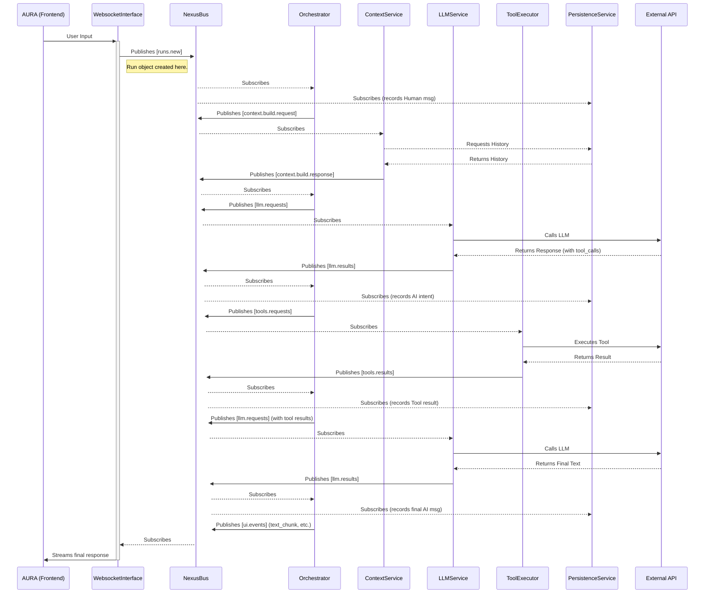

# 02: NEXUS Architecture - The Anatomy of a Digital Mind

This document provides a detailed architectural overview of the NEXUS backend. It explains how our services, guided by the principles of event-driven design, collaborate to form a cohesive, intelligent system.

## I. Core Architectural Paradigm: Event-Driven & Service-Oriented

The NEXUS backend is not a monolithic application with a linear request-response flow. It is a **decentralized network of specialized services** that communicate asynchronously through a central **event bus (`NexusBus`)**.

-   **Service-Oriented**: Each component (e.g., `Orchestrator`, `PersistenceService`) is an independent "organ" with a single, well-defined responsibility.
-   **Event-Driven**: Services do not call each other directly. Instead, they react to `Message` events published on the `NexusBus`. This ensures loose coupling, high scalability, and exceptional observability.

This paradigm transforms the system from a rigid machine into a resilient, adaptable organism.

## II. The Services (The Organs)

The NEXUS backend is composed of several key services, each playing a critical role in the system's "metabolism" of information.

-   **`WebsocketInterface`**: The **Sensory Organ**. It is the sole gateway to the external world, responsible for receiving user input and broadcasting UI events. It translates raw WebSocket traffic into the system's native `Message` format.

-   **`OrchestratorService`**: The **Central Nervous System / Prefrontal Cortex**. This is the brain of the operation. It does not perform any business logic itself. Its only job is to listen to events from other services and, based on the current state of a `Run`, decide which event to publish next. It is the master conductor of the entire conversational symphony.

-   **`ContextService`**: The **Cognitive Preparation Area**. Before the main "thinking" can happen, this service gathers all necessary information. It loads historical conversations from memory and injects personality from prompts. Crucially, it transforms all dynamic, real-time information (like the current client-side time) and the user's input into a structured XML format, ensuring that the context provided to the LLM is both rich and cache-friendly.

-   **`LLMService`**: The **Language Center**. This service is the sole bridge to the Large Language Model (e.g., Google's Gemini). It receives requests from the `Orchestrator`, formats them for the LLM API, and publishes the LLM's raw response back to the bus.

-   **`ToolExecutorService`**: The **Hands/Actuators**. This service listens for tool execution requests from the `Orchestrator`. It looks up the appropriate tool in the `ToolRegistry` and executes it in a non-blocking way, publishing the result back to the bus.

-   **`PersistenceService`**: The **Hippocampus / Long-Term Memory**(Store message history to database). This service is a passive listener on the bus. It subscribes to all significant events and silently records them into the database, ensuring that every "thought" and "experience" is permanently archived.

-   **`DatabaseService`**: The **Memory Storage Interface**. An abstraction layer that provides asynchronous methods for interacting with the database (e.g., MongoDB), decoupling the rest of the system from the specific database technology.

-   **`ConfigService`**: The **System's Living DNA**. This is a centralized service that provides all configuration parameters. Its defining feature is its **database-driven and environment-aware nature**. On startup, it connects to the database and loads the configuration specific to the current running environment (development or production), falling back to a safe, in-code default only in case of catastrophic failure. This allows for dynamic, real-time configuration changes without requiring a service restart

## III. The Flow of a Thought: A Complete Interaction Lifecycle

To understand how these organs work in concert, let's trace the event flow of a complete `Run` that involves a tool call.

**Analogy**: This is the journey of a single nerve impulse through the entire nervous system.

**Key Takeaways from the Flow:**

-   **The `Orchestrator` is central**: It is the only service that listens to responses from multiple other services (`ContextService`, `LLMService`, `ToolExecutorService`) and directs the next step.
-   **The `NexusBus` is ubiquitous**: Every arrow between services represents a `publish` or `subscribe` action on the bus.
-   **`PersistenceService` is a silent observer**: It taps into the event stream at critical points to build a complete historical record without ever interfering with the primary flow.
-   **The flow is a loop, not a line**: The path from `Orchestrator` to `LLMService` can be traversed multiple times within a single `Run`, forming the `Agentic Loop`.