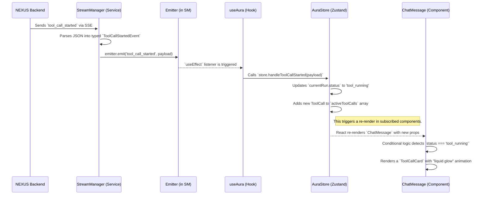

# 03: AURA Architecture - The Anatomy of a Living Interface

This document details the frontend architecture of AURA. It explains the principles and patterns we use to create a user interface that is not merely a "view," but a real-time, truthful mirror of the NEXUS engine's internal state.

## I. Core Architectural Paradigm: Unidirectional & State-Driven

AURA's architecture is built upon a strict **unidirectional data flow** model, inspired by modern reactive frontend patterns. This ensures that the UI is always a predictable function of its state, making the application easier to reason about, debug, and scale.

-   **Single Source of Truth**: All critical application state is centralized in a single global store (`Zustand`). Components do not own their state; they subscribe to it.
-   **State is Read-Only**: Components cannot directly modify the state. All state changes must be triggered by dispatching explicit `actions`.
-   **Events Drive State Changes**: Actions are triggered in response to either user interactions (e.g., sending a message) or events received from the NEXUS backend via HTTP+SSE.

This paradigm transforms the UI from a complex web of imperative updates into a simple, declarative system where **State -> UI**.

## II. The Layers of the Architecture (The Mind-Body Connection)

AURA's architecture is composed of four distinct layers, each with a clear and separate responsibility. This separation is key to maintaining a clean and scalable codebase.

-   **`Services` Layer (The Nerves)**: This is the outermost layer, responsible for all communication with the external world (the NEXUS backend).
    -   **`StreamManager`**: A pure, UI-agnostic service. Its sole job is to manage HTTP+SSE connections, parse incoming `NexusEvent` messages according to a strict `protocol.ts` definition, and broadcast these typed events to the rest of the application using a lightweight event emitter. It knows nothing about state or UI.

-   **`Store` Layer (The Mind / State Model)**: This is the heart of AURA's client-side intelligence.
    -   **`AuraStore` (`Zustand`)**: The single source of truth. It holds the entire state of the conversation, including the `messages` history and, crucially, the `currentRun` object, which mirrors the status of the active interaction in NEXUS. Its `actions` are the only sanctioned way to mutate the state.

-   **`Hooks` Layer (The Controller / Motor Cortex)**: This layer acts as the crucial bridge between the raw external world and the internal state model.
    -   **`useAura`**: This central hook is the primary consumer of our architecture. It subscribes to events from the `StreamManager` and, in response, calls the appropriate `actions` on the `AuraStore`. It then selects and exposes the necessary state from the store to the UI components. It is the orchestrator of the frontend data flow.

-   **`Components` Layer (The Body / Expression)**: This is the purely visual layer.
    -   **Container Components (`ChatContainer`)**: These components use the `useAura` hook to access state and actions, and are responsible for passing them down to presentational components. They contain the "logic" of which components to render.
    -   **Presentational Components (`ChatMessage`, `ToolCallCard`)**: These components are "dumb." They receive all data and functions as props and are solely responsible for rendering the UI. They contain no business logic and make no direct calls to stores or services.

## III. The Flow of an Event: From Nerve Impulse to Facial Expression

To understand how these layers work together, let's trace the flow of a single `tool_call_started` event from NEXUS to the user's screen.

**Key Takeaways from the Flow:**

-   **Strict Unidirectionality**: The data flows in one clean, unbroken line from the SSE stream to the component. There are no shortcuts or reverse channels.
-   **Clear Responsibilities**: Each layer performs its designated task without encroaching on the others. The `StreamManager` doesn't know what a `ToolCallCard` is, and the `ToolCallCard` doesn't know what HTTP+SSE is.
-   **Predictability**: Because the UI is a pure function of the `AuraStore`'s state, we can reliably predict what the screen will look like at any given moment by simply inspecting the store. This also makes debugging and testing significantly easier.
-   **Reactivity**: The entire chain, from event reception to UI update, is reactive. The UI automatically "reacts" to changes in the central state, which in turn reacts to events from the backend.