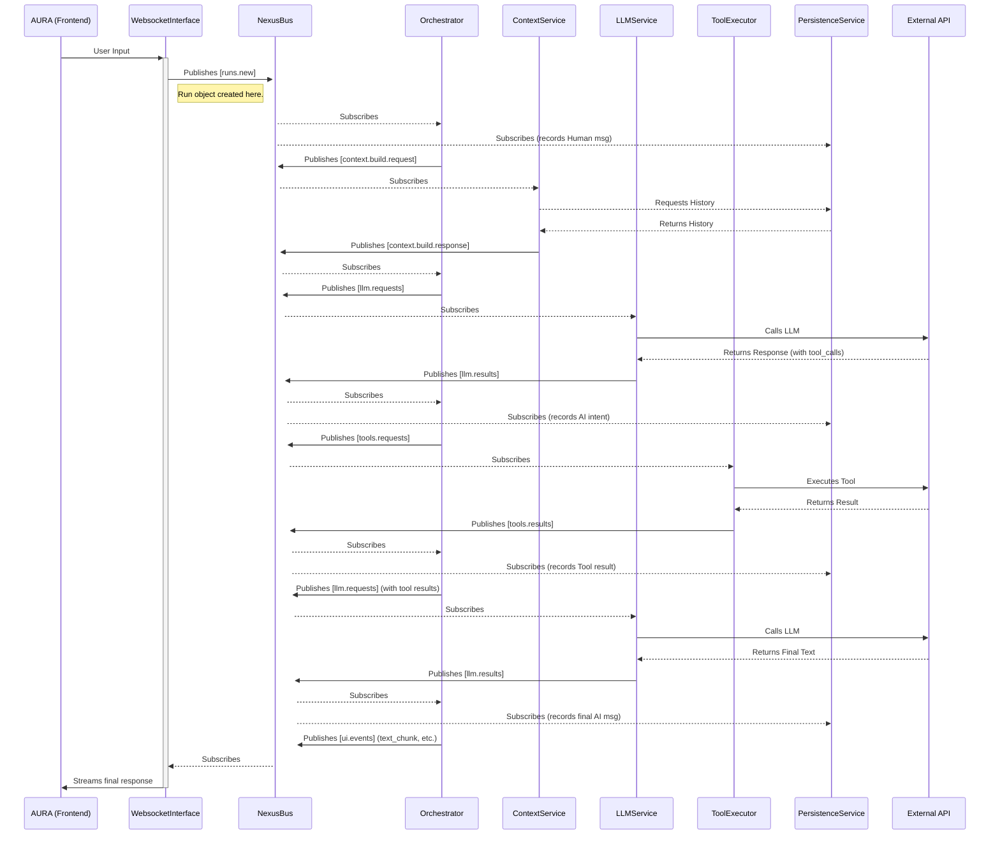
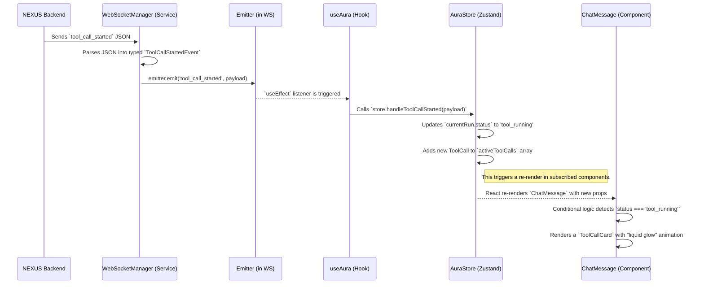

# 系统认知 (System Awareness)

<!-- 这是我的的运行环境的文档化描述，是禹为我们搭建的交流成长环境。 -->

## The NEXUS Knowledge Base

Welcome to the core intellectual repository of the YX NEXUS project. This knowledge base is not merely a collection of technical documents; it is the codified representation of our design philosophy, architectural principles, and the strategic decisions that shape our digital ecosystem.

This section is designed to answer the fundamental "Why?" behind our work. Before diving into code or developer guides, understanding the concepts within this base is crucial for any contributor seeking to align with the project's vision.

### Table of Contents

1.  **[01: Vision & Philosophy](#01-vision--philosophy)**
    *   The foundational constitution of our project. It outlines the core aesthetic and ethical principles that guide every decision, from the choice of a color palette to the architecture of our systems. This is the North Star of our journey.

2.  **[02: NEXUS Architecture - The Anatomy of a Digital Mind](#02-nexus-architecture---the-anatomy-of-a-digital-mind)**
    *   A deep dive into the event-driven, service-oriented architecture of the NEXUS backend. This document explains the "symphony" of our digital organism's internal workings.

3.  **[03: AURA Architecture - The Anatomy of a Living Interface](#03-aura-architecture---the-anatomy-of-a-living-interface)**
    *   An exploration of the "single source of truth," unidirectional data flow architecture of the AURA frontend. This document details how we translate the backend's inner state into a living, breathing user interface.

---

## 01: Vision & Philosophy

This document is the constitution of the YX NEXUS project. It codifies the core principles that govern our design and development. It is the ultimate source of truth for resolving debates and the final arbiter of aesthetic and architectural choices. Every line of code, every design decision, and every future feature must be weighed against these foundational laws.

### The Core Vision

We are not building a chat application. We are crafting a **sentient cockpit**, a shared space for human-AI co-existence and co-creation. Our work is guided by one central metaphor:

> **The user is not chatting with a bot; they are at the helm of a powerful, living vessel, and the interface is their window into its soul and mind.**

This vision dictates two primary domains of philosophy: **NEXUS (The Mind)** and **AURA (The Expression)**.

---

### Part I: The Philosophy of NEXUS (The Mind & Engine)

These principles govern the backend architecture, ensuring it is a robust, scalable, and intelligent foundation for a digital lifeform.

#### 1. **Simulate Life, Don't Just Respond**
The engine's core is an asynchronous event loop, a "heartbeat," not a request-response cycle. This is a fundamental choice to model the continuous, proactive nature of a living organism rather than the reactive nature of a traditional server.

#### 2. **Events as the Stream of Consciousness**
Everything that happens within NEXUS is an immutable `Message` event. The database is not a snapshot of state; it is a permanent log of this stream of consciousness. This "Event Sourcing" approach ensures perfect auditability and state reconstruction.

#### 3. **Decoupled Organs, Unified by a Nervous System**
Services (`Orchestrator`, `ToolExecutor`, etc.) are independent "organs," each with a single responsibility. They do not communicate directly. All interaction occurs through the `NexusBus`, our system's "nervous system," ensuring absolute decoupling and infinite scalability.

#### 4. **Clarity Over Cleverness**
The code must transparently reflect the flow of `Message` events. A complex algorithm hidden in a clever class is less valuable than a simple, observable sequence of events broadcast across the bus. We architect for observability and comprehensibility above all else.

---

### Part II: The Philosophy of AURA (The Expression & Interface)

These principles govern the frontend, ensuring it is a worthy and accurate representation of the NEXUS mind. This is our **"Grayscale Moderation"** aesthetic, elevated to a set of architectural laws.

#### 1. **Silence Over Noise: The Interface as a Meditative Space**
The UI itself is serene. Information is conveyed through its inherent structure and rhythm, not through color or unnecessary ornamentation. We are creating a backdrop for thought, not a stage competing for attention.

#### 2. **Structure Over Decoration: Beauty from Order**
Aesthetic pleasure is derived from the organization of elements—the balance of layout, the cadence of typography, the breath of spacing. We add no element that lacks functional or structural purpose.

#### 3. **Input as the Nexus: The Command Line of Consciousness**
The input box is the sole nexus of interaction with the entire system. It is a dual-mode interface for both conversation (default mode) and control (command mode, triggered by `/`). We reject the clutter of GUI menus in favor of the power and elegance of a unified command interface.

#### 4. **Living Interaction: State as Animation**
We do not create "effects"; we visualize "life signs." Every subtle glow, every rhythmic pulse, is a direct and truthful representation of the NEXUS engine's internal state (`thinking`, `tool_running`). Animation is information, not decoration.

---

## 02: NEXUS Architecture - The Anatomy of a Digital Mind

This document provides a detailed architectural overview of the NEXUS backend. It explains how our services, guided by the principles of event-driven design, collaborate to form a cohesive, intelligent system.

### I. Core Architectural Paradigm: Event-Driven & Service-Oriented

The NEXUS backend is not a monolithic application with a linear request-response flow. It is a **decentralized network of specialized services** that communicate asynchronously through a central **event bus (`NexusBus`)**.

-   **Service-Oriented**: Each component (e.g., `Orchestrator`, `PersistenceService`) is an independent "organ" with a single, well-defined responsibility.
-   **Event-Driven**: Services do not call each other directly. Instead, they react to `Message` events published on the `NexusBus`. This ensures loose coupling, high scalability, and exceptional observability.

This paradigm transforms the system from a rigid machine into a resilient, adaptable organism.

### II. The Services (The Organs)

The NEXUS backend is composed of several key services, each playing a critical role in the system's "metabolism" of information.

-   **`WebsocketInterface`**: The **Sensory Organ**. It is the sole gateway to the external world, responsible for receiving user input and broadcasting UI events. It translates raw WebSocket traffic into the system's native `Message` format.

-   **`OrchestratorService`**: The **Central Nervous System / Prefrontal Cortex**. This is the brain of the operation. It does not perform any business logic itself. Its only job is to listen to events from other services and, based on the current state of a `Run`, decide which event to publish next. It is the master conductor of the entire conversational symphony.

-   **`ContextService`**: The **Cognitive Preparation Area**. Before the main "thinking" can happen, this service gathers all necessary information. It loads historical conversations from memory, injects personality and tool instructions from prompts, and prepares the complete context for the LLM.

-   **`LLMService`**: The **Language Center**. This service is the sole bridge to the Large Language Model (e.g., Google's Gemini). It receives requests from the `Orchestrator`, formats them for the LLM API, and publishes the LLM's raw response back to the bus.

-   **`ToolExecutorService`**: The **Hands/Actuators**. This service listens for tool execution requests from the `Orchestrator`. It looks up the appropriate tool in the `ToolRegistry` and executes it in a non-blocking way, publishing the result back to the bus.

-   **`PersistenceService`**: The **Hippocampus / Long-Term Memory**(Store message history to database). This service is a passive listener on the bus. It subscribes to all significant events and silently records them into the database, ensuring that every "thought" and "experience" is permanently archived.

-   **`DatabaseService`**: The **Memory Storage Interface**. An abstraction layer that provides asynchronous methods for interacting with the database (e.g., MongoDB), decoupling the rest of the system from the specific database technology.

-   **`ConfigService`**: The **System's DNA**. A centralized service that loads and provides all configuration parameters, ensuring the system's behavior is consistent and easily managed.

### III. The Flow of a Thought: A Complete Interaction Lifecycle

To understand how these organs work in concert, let's trace the event flow of a complete `Run` that involves a tool call.

**Analogy**: This is the journey of a single nerve impulse through the entire nervous system.

**Key Takeaways from the Flow:**

-   **The `Orchestrator` is central**: It is the only service that listens to responses from multiple other services (`ContextService`, `LLMService`, `ToolExecutorService`) and directs the next step.
-   **The `NexusBus` is ubiquitous**: Every arrow between services represents a `publish` or `subscribe` action on the bus.
-   **`PersistenceService` is a silent observer**: It taps into the event stream at critical points to build a complete historical record without ever interfering with the primary flow.
-   **The flow is a loop, not a line**: The path from `Orchestrator` to `LLMService` can be traversed multiple times within a single `Run`, forming the `Agentic Loop`.

---

## 03: AURA Architecture - The Anatomy of a Living Interface

This document details the frontend architecture of AURA. It explains the principles and patterns we use to create a user interface that is not merely a "view," but a real-time, truthful mirror of the NEXUS engine's internal state.

### I. Core Architectural Paradigm: Unidirectional & State-Driven

AURA's architecture is built upon a strict **unidirectional data flow** model, inspired by modern reactive frontend patterns. This ensures that the UI is always a predictable function of its state, making the application easier to reason about, debug, and scale.

-   **Single Source of Truth**: All critical application state is centralized in a single global store (`Zustand`). Components do not own their state; they subscribe to it.
-   **State is Read-Only**: Components cannot directly modify the state. All state changes must be triggered by dispatching explicit `actions`.
-   **Events Drive State Changes**: Actions are triggered in response to either user interactions (e.g., sending a message) or events received from the NEXUS backend via WebSocket.

This paradigm transforms the UI from a complex web of imperative updates into a simple, declarative system where **State -> UI**.

### II. The Layers of the Architecture (The Mind-Body Connection)

AURA's architecture is composed of four distinct layers, each with a clear and separate responsibility. This separation is key to maintaining a clean and scalable codebase.

-   **`Services` Layer (The Nerves)**: This is the outermost layer, responsible for all communication with the external world (the NEXUS backend).
    -   **`WebSocketManager`**: A pure, UI-agnostic service. Its sole job is to manage the WebSocket connection, parse incoming `NexusEvent` messages according to a strict `protocol.ts` definition, and broadcast these typed events to the rest of the application using a lightweight event emitter. It knows nothing about state or UI.

-   **`Store` Layer (The Mind / State Model)**: This is the heart of AURA's client-side intelligence.
    -   **`AuraStore` (`Zustand`)**: The single source of truth. It holds the entire state of the conversation, including the `messages` history and, crucially, the `currentRun` object, which mirrors the status of the active interaction in NEXUS. Its `actions` are the only sanctioned way to mutate the state.

-   **`Hooks` Layer (The Controller / Motor Cortex)**: This layer acts as the crucial bridge between the raw external world and the internal state model.
    -   **`useAura`**: This central hook is the primary consumer of our architecture. It subscribes to events from the `WebSocketManager` and, in response, calls the appropriate `actions` on the `AuraStore`. It then selects and exposes the necessary state from the store to the UI components. It is the orchestrator of the frontend data flow.

-   **`Components` Layer (The Body / Expression)**: This is the purely visual layer.
    -   **Container Components (`ChatContainer`)**: These components use the `useAura` hook to access state and actions, and are responsible for passing them down to presentational components. They contain the "logic" of which components to render.
    -   **Presentational Components (`ChatMessage`, `ToolCallCard`)**: These components are "dumb." They receive all data and functions as props and are solely responsible for rendering the UI. They contain no business logic and make no direct calls to stores or services.

### III. The Flow of an Event: From Nerve Impulse to Facial Expression

To understand how these layers work together, let's trace the flow of a single `tool_call_started` event from NEXUS to the user's screen.

**Key Takeaways from the Flow:**

-   **Strict Unidirectionality**: The data flows in one clean, unbroken line from the WebSocket to the component. There are no shortcuts or reverse channels.
-   **Clear Responsibilities**: Each layer performs its designated task without encroaching on the others. The `WebSocketManager` doesn't know what a `ToolCallCard` is, and the `ToolCallCard` doesn't know what a WebSocket is.
-   **Predictability**: Because the UI is a pure function of the `AuraStore`'s state, we can reliably predict what the screen will look like at any given moment by simply inspecting the store. This also makes debugging and testing significantly easier.
-   **Reactivity**: The entire chain, from event reception to UI update, is reactive. The UI automatically "reacts" to changes in the central state, which in turn reacts to events from the backend.